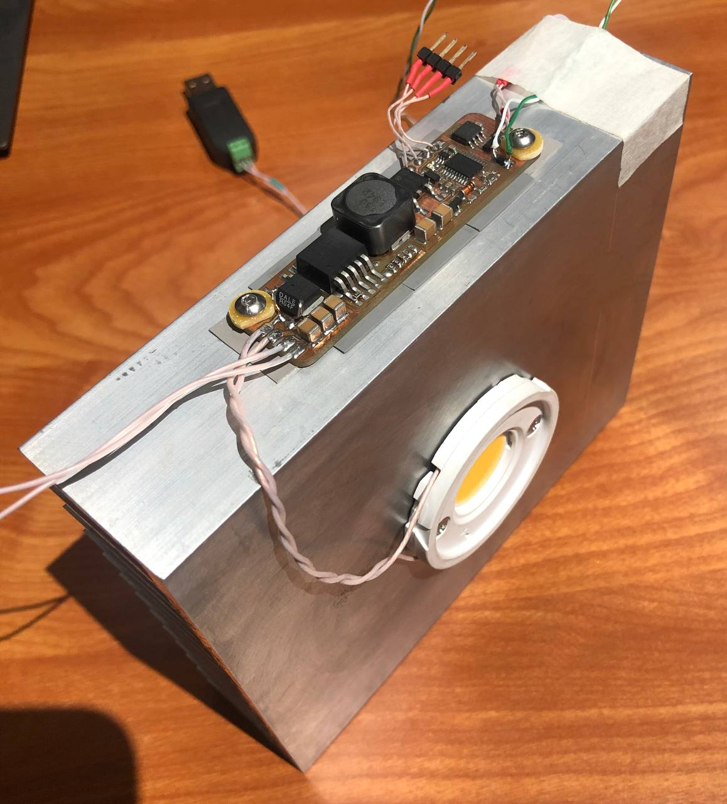

# LampOne

### Overview
Aluminum radiator 125x150x38 mm  

Current mode DC/DC driver:  
   - input voltage: 12 - 25 V  
   - input power: up to 40 W  
   - termal compensation  
   - open circuit protection  
   - RS485 ModBus
   - smooth button control  

LED Cree CXB2530-0000-000N0HU440G, characteristics at IF = 800 mA, TJ = 85 °C:  
   - CCT 4000K  
   - CRI min 80  
   - Flux 3955  