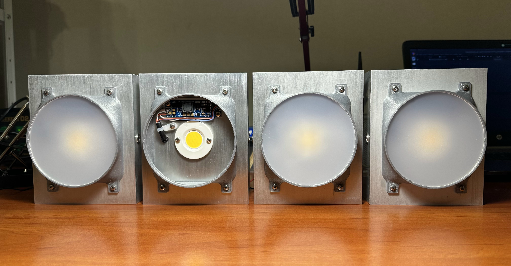

# LampOne

Lamp appearance. For more photos to /Photo.

## Overview
  - Dimension (without bracket) 128x150x58 mm  
  - weight (without bracket) 695 g

##LED
LED Cree CXB2530-0000-000N0HU440G, characteristics at IF = 800 mA, TJ = 85 °C:  
  - CCT 4000K  
  - CRI min 80  
  - Flux 3955  

## LED Driver  
  - input voltage: 6 - 26 V, recommended 24 V  
  - output current 0.01 - 1.5 A
  - power: up to 60 W  
  - save settings to flash  
  - RS485 ModBus for calibration and control  
  - output power is limited when temperature is greater than 85 °C  
  - output power is linear limited if the input voltage is less than 15.0 V, At 6.0 V maximum output current is 0.3 A  
  - smooth button control from 10 mA to 1 A  

##Connection
  - use 5 pin connector, pinout:
    - 1 (white)  - GND
    - 2 (red)    - Power +6-26V
    - 3 (brown)  - RS485 B
    - 4 (violet) - RS485 A
    - 5 (black)  - Switch button
